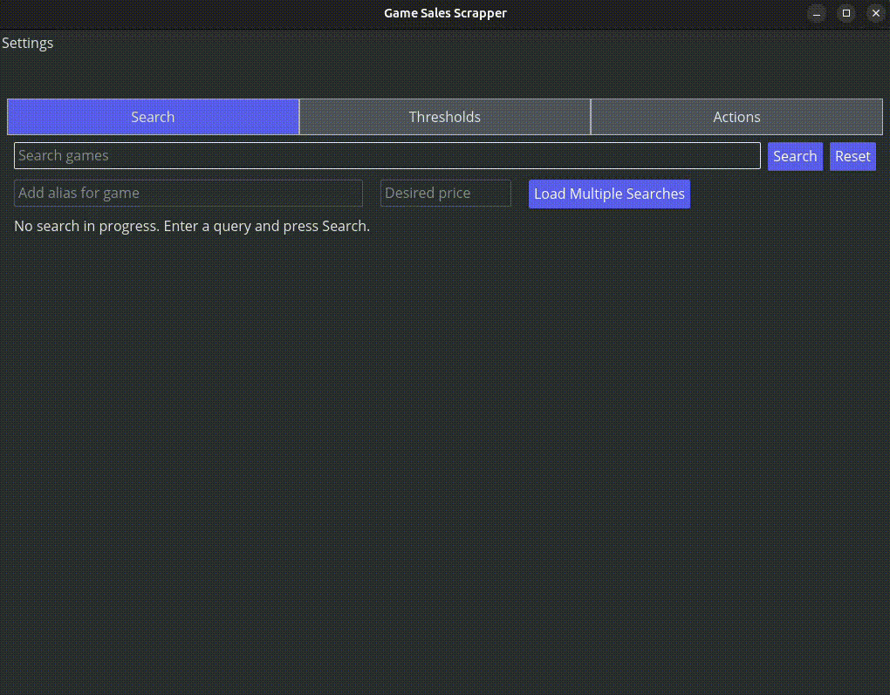

# Game Sales Scrapper
 
 
 
 

Roadmap: [[link](./docs/Roadmap.md)]

A tool that monitors multiple game storefronts and sends email alerts when a game reaches the user-defined price threshold.

### Supported Storefronts
- **Steam**
- **Good Old Games (GOG)**
- **Microsoft Store (PC)**

### Dependencies
- Steam Web API key := https://steamcommunity.com/dev
- For self-hosting:
    - SMTP server
    - Domain

## Quick Start
1. Setup SMTP server/service (TLS required)
2. Navigate to project folder and run `cargo build --release`
3. In the project folder, create `.env` with the following:
    ```
    STEAM_API_KEY={your_steam_api_key}
    RECIPIENT_EMAIL={destination_email_address}
    SMTP_HOST={smtp_host_domain}
    SMTP_PORT={port_number}
    SMTP_EMAIL={smtp_email_address}
    SMTP_USERNAME={smtp_username}
    SMTP_PWD={stmp_password}
    PROJECT_PATH={/path/to/game_sales_scrapper}
    TEST_PATH={/path/to/test_directory}
    ```
    - For Windows use `\\` when defining the path.
4. Initialize settings and properties (refer to [CLI](#cli))
5. Add games and their respective price threshold using the [CLI](#cli) or [app](#application) 
6. You can run either the application or cli using `cargo run -p <crate>`
7. [Optional] Automate emails (in `scripts/` folder)
    - **For Unix-based systems:** Update *SCHEDULE* variable to desired execution frequency and run `set_cron.sh -c create` with root privileges.
    - **For Windows systems:** Update *$trigger* variable to desired execution frequency and run `set_task_scheduler.ps1 -Cmd "create"`. 
    
        If PowerShell scripts execution is not enabled run the following with administrative privileges: 
        ```
        Set-ExecutionPolicy RemoteSigned
        ```
8. [Optional] Run tests locally `cargo test -- --test-threads=1`

## CLI
Use the`--help` flag in command line to get more information on the supported commands. Here's a brief description and example of each command.
- `config` := sets what storefronts are used to search for games and enable aliases for game titles (enabled by default). 
    - `settings` := determine which storefront to search, whether aliases are enabled for games, and whether an alias can be reused (useful for different editions of the same product)
    -  `properties` := set the properties based on `.env` file or command line
        - `-z` := toggles whether the testing mode is enabled (if enabled script uses the `TEST_PATH` environment variable)
  ```commandline
    # Configure settings 
    gss-cli config settings -a -e 1 -r 0
    # Update properties with .env
    gss-cli config properties -f
    ```
- `add` := add a specified game (title must be exact to work).
    ```commandline
    gss-cli add --title <title> --price <price>
    ```
- `bulk-insert` := add multiple games with a price threshold using a CSV file.
    ```commandline
    gss-cli bulk-insert --file <file.csv>
    ```
    CSV Example:
    ```
    games, price
    Hollow Knight, 9.99
    Cyberpunk 2077, 19.99
    Hades, 9.99
    Stardew Valley, 7.99
    ```
- `update` := update price threshold for a specified game.
    ```commandline
    gss-cli update --title <title> --price <price>
    ```
- `remove` := remove a specified game.
    ```commandline
    gss-cli remove --title <title>
    ```
- `list-selected-stores` := list whether a storefront is used to search for games.
    ```commandline 
    gss-cli --list-selected-stores
    ```
- `list-thresholds` := list all the stored price thresholds for selected games.
    ```commandline
    gss-cli --list-thresholds
    ```
- `update-cache` := update the locally stored cache of steam games (title and app ids).
    ```commandline
    gss-cli --update-cache
    ```
- `check-prices` := print out any games that are on sale that meet user respective price threshold.
    ```commandline
    gss-cli --check-prices
    ```
- `send-email` := sends an email (using SMTP) containing a list of games that are below user defined price threshold for each game. No email is sent if no game has reached their price threshold.
    ```commandline 
    gss-cli --send-email
    ```

## Application

Run the following command to open the application.
```
gss-app
```
